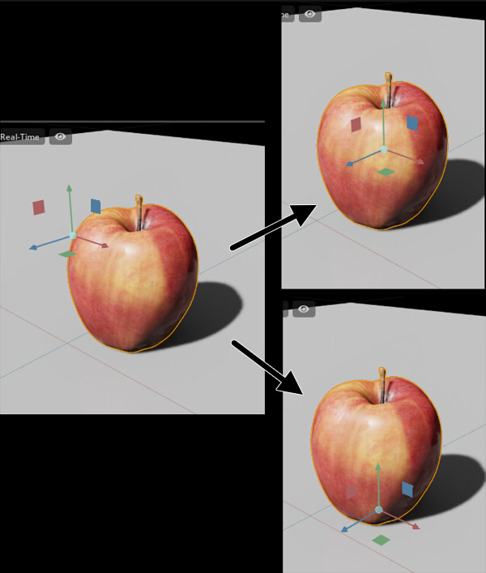
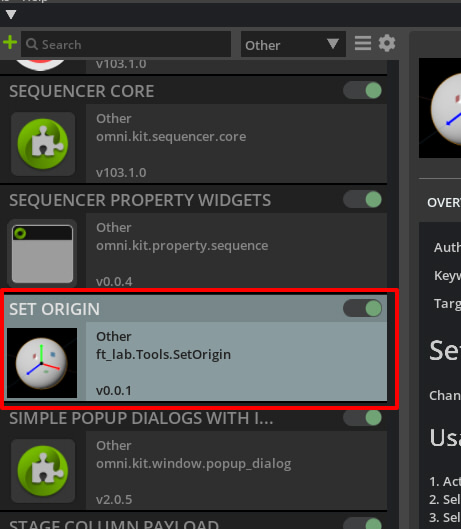
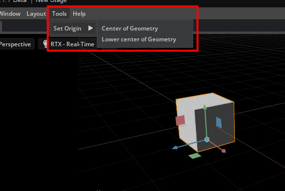

# Omniverse Extension : "Set Origin"

[Japanese readme](./readme_jp.md)     

Changes the center position of the rotation or scale for the selected Mesh or Xform.    

    

## Operating Environment

* Omniverse Create 2022.1.1/Omniverse Kit 103 
* Omniverse Code 2022.1.0

## Usage

1. Copy "ft_lab.Tools.SetOrigin" to the exts folder in Omniverse.     
(ov/pkg/create-2022.1.1/exts , etc.)    
2. Run Omniverse Create.     
3. Activate "ft_lab.Tools.SetOrigin" in the Extension window.
    
4. Select Mesh or Xform.
5. Select "Tools"-"Set Origin"-"Center of Geometry" from the menu to move the center of the manipulator to the center of the geometry.
6. Select "Tools"-"Set Origin"-"Lower center of Geometry" from the menu to move the center of the manipulator to the lower center of the geometry.

    

## Operation Description

This Set Origin function adjusts the Translate and Pivot of the Prim.     

Add "ToolSetOrigin" to omni.kit.commands.      
The argument "prim" specifies Usd.Prim.     
The argument "center_position" specifies the center position in world coordinates.     

```python
import omni.kit.commands
from pxr import Usd, Gf

omni.kit.commands.execute('ToolSetOrigin',
	prim=Usd.Prim(</World/xxx>),
	center_position=Gf.Vec3f(50.0, -50.0, 0.0))
```

## Update log

[Update log](./update_log.md)    


