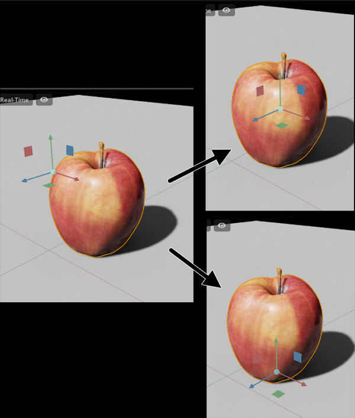
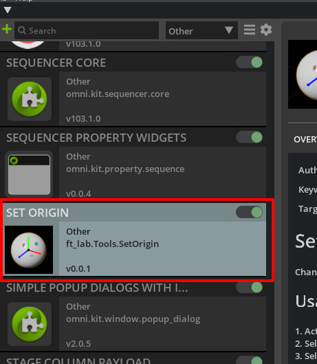
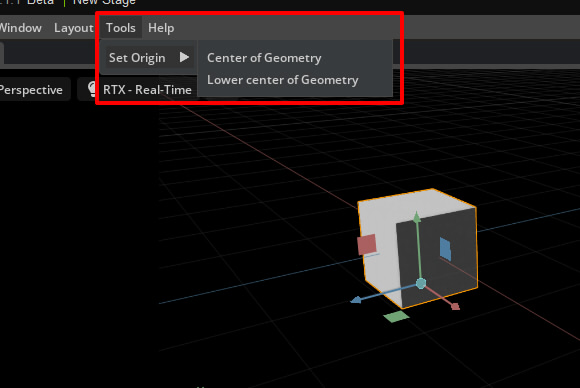

# Omniverse Extension : "Set Origin"

[English readme](./readme.md)     

選択されたMeshまたはXformの回転またはスケールの中心位置を変更します。    
    

## 動作確認環境

* Windows 10/Ubuntu 20.04
* Omniverse Create 2022.1.1 (Omniverse Kit 103)
* Omniverse Code 2022.1.0

## 使い方

1. "ft_lab.Tools.SetOrigin"を Omniverseのextフォルダにコピーします。      
(ov/pkg/create-2022.1.1/exts など)    
2. Omniverse Createを起動します。     
3. Extensionウィンドウで"ft_lab.Tools.SetOrigin"をアクティブにします。     
    
4. MeshまたはXformを選択します。
5. "Tools"-"Set Origin"-"Center of Geometry"をメニューから選択すると、マニピュレータの中心がジオメトリの中心位置になります。
6. "Tools"-"Set Origin"-"Lower center of Geometry"をメニューから選択すると、マニピュレータの中心が ジオメトリの中央下の位置になります。     

    

## Pythonでの追加コマンド

Set Origin機能は、PrimのTranslateとPivotを調整する機能を提供します。     

omni.kit.commandsに"ToolSetOrigin"を追加しています。     
引数"prim"はUsd.Primを指定します。     
引数"center_position"はワールド座標での中心にする位置を指定します。    

```python
import omni.kit.commands
from pxr import Usd, Gf

omni.kit.commands.execute('ToolSetOrigin',
	prim=Usd.Prim(</World/xxx>),
	center_position=Gf.Vec3f(50.0, -50.0, 0.0))
```
## Omniverse Extensionでのスクリプトの参考

[https://github.com/ft-lab/omniverse_sample_scripts](https://github.com/ft-lab/omniverse_sample_scripts)    


## 更新履歴

[Update log](./update_log.md)    

